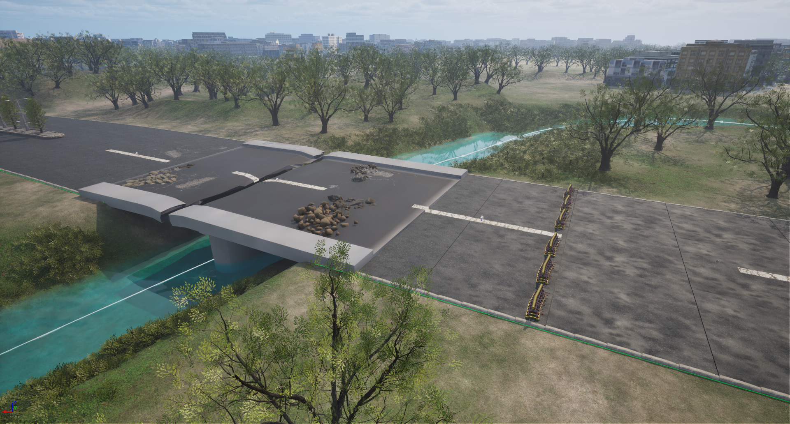

适用对象：城市战场仿真场景中“三维战场场景局部更新”功能的回归测试

输入：无人机 / 无人狗等侦察源采集的侦察录像（及位姿元数据）

待测能力：基于侦察数据，检测战场局部变化，并将原有三维场景同步更新（几何替换、目标插入/删除、动态目标同步、语义/通行性更新），实现态势实时刷新。

## 1. 通用约定与指标体系

### 1.1 设计原则

1.  覆盖性

变化类型覆盖“正变化(新增)、负变化(消失)、形变(损毁)、动态(时敏)、语义(通行性)、地表(高程)”六大维度。

2.  可量化

每类想定都附带真值(Ground Truth)定义与数值化通过门限，避免“看起来更新了”这类主观判断。

3.  抗作弊

每个场景都强制保留静默对照区(无变化区域)，专门检验模块“是否乱改未变化的部分”——这是态势更新最危险的失效模式。

4.  难度分层

从单一清晰变化 → 弱信号/强干扰 → 退化感知 → 复合密集,形成梯度

5.  可复现

所有摆放、动线、航线用统一坐标与参数描述,UE内可一次性复刻。

### 1.2 坐标与标注约定

- 采用本地 ENU 坐标系：原点取地块西南角，X 轴指东、Y 轴指北、Z 轴朝上，单位米。

- 地块尺寸记为 $W \times D$（东西 × 南北）。点位记为 (x, y, z)，航点同。

- 每个变化实例须导出真值条目：{id, 类别, 中心点(x,y,z), 朝向yaw, 包围盒尺寸(l,w,h), 损毁等级, 出现/消失标志, 轨迹(若动态)}。

- 真值由 UE 场景脚本直接导出（场景即真值来源），无需人工再标注。

### 1.3 侦察源能力假设（用于统一录制条件设定，可按实际平台标准调整）

| **平台**     | **传感器**                          | **典型作业参数**                              | **用途**                                 |
|--------------|-------------------------------------|-----------------------------------------------|------------------------------------------|
| 无人机(旋翼) | EO 4K@30fps + 云台，选配 IR/多光谱 | 飞行高度 30–120 m AGL，巡航 3–8 m/s，盘旋凝视 | 区域测绘、顶视/斜视、运动目标跟踪        |
| 无人狗(地面) | EO + 选配 LiDAR，传感器高 $\sim 0.5$ m | 1–2 m/s，可抵近/入室                          | 低矮工事贴地侦察、内部走廊、坑深桥况近测 |

### 1.4 损毁分级标准

| **等级** | **名称** | **判定特征**                           |
|----------|----------|----------------------------------------|
| D0       | 无损     | 结构与外立面完好                       |
| D1       | 轻度     | 门窗/外立面/装饰破损，承重结构完好     |
| D2       | 中度     | 局部墙体穿孔或单层塌落，结构基本完好   |
| D3       | 重度     | 多层或承重构件受损、局部坍塌、瓦砾外溢 |
| D4       | 摧毁     | 整体坍塌为瓦砾堆，原结构不可辨         |

### 1.5 统一指标定义

#### （1）变化检测匹配

预测变化实例与真值实例匹配，当且仅当：中心距 $\leq d_{\text{match}}$ 且类别一致（或三维 IoU $\geq 0.3$）。

建议 $d_{\text{match}} = 1.0$ m（静态）/ $2.0$ m（时敏目标）。

#### （2）检测层

$$\text{Precision} = \frac{TP}{TP + FP},\text{Recall} = \frac{TP}{TP + FN},F1 = \frac{2\,\text{Precision} \cdot \text{Recall}}{\text{Precision} + \text{Recall}}$$

#### （3）定位精度

$$e_{\text{pos}} = \left\| \mathbf{p}_{\text{pred}} - \mathbf{p}_{\text{gt}} \right\|_{2},e_{\text{yaw}} = \left| \,\text{wrap}\left( \theta_{\text{pred}} - \theta_{\text{gt}} \right)\, \right|$$

#### （4）几何重建精度

三维包围盒交并比与点云/网格 Chamfer 距离：

$$\text{IoU}_{3D} = \frac{V_{\text{pred}} \cap V_{\text{gt}}}{V_{\text{pred}} \cup V_{\text{gt}}}$$

$$d_{CD}\left( S_{1},S_{2} \right) = \frac{1}{\left| S_{1} \right|}\sum_{x \in S_{1}} \min_{y \in S_{2}}\left\| x - y \right\|_{2}^{2} + \frac{1}{\left| S_{2} \right|}\sum_{y \in S_{2}} \min_{x \in S_{1}}\left\| x - y \right\|_{2}^{2}$$

#### （5）地表高程精度

$$\text{RMSE}_{z} = \sqrt{\frac{1}{N}\sum_{i = 1}^{N}\left( z_{i}^{\text{pred}} - z_{i}^{\text{gt}} \right)^{2}}$$

#### （6）时敏目标跟踪

位置 RMSE、速度误差 $e_{v} = \left\| \mathbf{v}_{\text{pred}} - \mathbf{v}_{\text{gt}} \right\|$、ID 切换次数、检测时延 $T_{\text{lat}}$（目标进入视野到被建立航迹的时间），并用 MOTA/MOTP 汇总。

#### （7）静默区稳定性（关键防作弊指标）

未变化区域被错误修改的占比：

$$S_{\text{drift}} = \frac{\text{被修改的未变化体素}\text{(}\text{或面积}\text{)}}{\text{未变化区域总量}}$$

要求越小越好。

#### （8）时效性

端到端更新时延 $T_{\text{update}}$：从单次侦察数据就绪到场景完成局部更新所耗时间（区分离线批处理模式与近实时模式）。

#### （9）鲁棒性保持率（退化条件场景）

$$\rho = \frac{\text{得分}_{\text{退化条件}}}{\text{得分}_{\text{基准条件}}}$$

### 1.6 通过门限

| **指标**                                         | **建议门限**                          |
|--------------------------------------------------|---------------------------------------|
| 静态变化检测 F1                                  | $\geq 0.85$                         |
| 时敏目标检测召回                                 | $\geq 0.90$                         |
| 损毁分级（±1 级容差）准确率                      | $\geq 0.90$；严格准确 $\geq 0.70$     |
| 静态目标位置误差                                 | 中位 $\leq 0.5$ m，95 分位 $\leq 1.0$ m |
| 朝向误差                                         | $\leq 15^{\circ}$                   |
| 几何 $\text{IoU}_{3D}$（损毁体/工事体）          | $\geq 0.50$                         |
| 地表高程 $\text{RMSE}_{z}$                       | $\leq 0.30\,\mathrm{m}$                        |
| TST 位置 RMSE / 速度误差                         | $\leq 1.0\,\mathrm{m} / \leq 1.0\,\mathrm{m}\cdot\mathrm{s}^{-1}$    |
| TST 检测时延 / ID 切换                           | $\leq 2\,\mathrm{s} / \leq 1$ 次·目标$^{-1}$·分钟$^{-1}$     |
| 静默区稳定性 $S_{\text{drift}}$                  | $\leq 2\%$                          |
| 鲁棒性保持率 $\rho$                              | $\geq 0.75$                         |
| 端到端更新时延 $T_{\text{update}}$（近实时模式） | $\leq 5$ s（按需设定）                 |

### 1.7 评分与判定

- 每个场景按其权重指标归一到 0–100 分，单场景 $\ge 70$ 记为通过。

- Benchmark 综合分 = 各场景加权平均。

- 否决项：S4（时敏目标）与 S9（复合密集）设下限，任一低于 50 分则整体判不通过——因为这两项直接对应“实时态势”的核心价值。

## 2. 场景想定

### S1 建筑物损毁

**测试能力**：几何形变检测、损毁等级判定、瓦砾/碎片建模、原有三维网格的局部替换。

场景范围：$180 \times 180$ m 城市街区。沿街布置 7 栋建筑（3–8 层混合），含主街、人行道、行道树。

**基线（更新前）场景**：所有建筑 D0 完好；街道整洁无碎片。

验证指标与通过判据：

- 损毁分级 ±1 级准确率 $\geq 0.90$，且 B1/B2/B3 的严格分级至少 2/3 正确。

- 形变体 $\text{IoU}_{3D} \geq 0.5$；瓦砾堆体积误差 $\leq 25\%$；B2 楼高下降量误差 $\leq 1.0$ m。

- B0 静默稳定性 $S_{\text{drift}} \leq 2\%$（误把完好楼改成损毁即判该项失败）。

未损毁状态（baseline）

D2中度损毁状态

D3重度损毁状态

D4摧毁状态

### S2 新增野战工事与掩体

**测试能力**：低矮小目标的新增检测、分类、尺寸/朝向估计与插入定位；区分人工工事与天然/废弃堆积物。

**场景范围**：$220 \times 160$ m 城郊接合带，含开阔空地、矮墙、3 栋平房。

**基线场景**：空地无任何工事。

**验证指标与通过判据**：

- 工事新增检测召回 $\geq 0.85$，分类准确 $\geq 0.85$。

- 位置误差中位 $\leq 0.5$ m；堑壕/HESCO 长度误差 $\leq 15\%$；朝向误差 $\leq 15^{\circ}$。

- 干扰项不被标为“新增工事”（误报即扣分）；废弃水泥堆静默稳定。

新增工事前（baseline）

新增工事后

### S3 目标消失 / 移除（负变化）

**测试能力**：负变化检测（最易被忽略）；区分“被遮挡”与“真消失”。

**场景范围**：$150 \times 150$ m 院落与停车区。

**基线场景**：停放车辆、临时帐篷、沙袋掩体、矮墙。

**验证指标与通过判据**：

- 移除检测召回 $\geq 0.85$、精确率 $\geq 0.85$。

- 遮挡误判率：被遮挡但仍存在的目标被误报为“消失”的比例 $\leq 10\%$。

- 沙袋掩体静默稳定 $S_{\text{drift}} \leq 2\%$。

目标消失前（baseline）

目标消失

### S4 时敏目标

**测试能力**：动态目标实时检测、连续跟踪、轨迹与速度估计、场景的近实时同步更新、军/民目标区分。

**场景范围**：$300 \times 200$ m，含一条东西主干道、一个十字路口、一个广场。

**基线场景**：道路空旷无车。

动态动线（时间以侦察开始为 $t=0$）：

- 装甲车：沿主干道巡航；减速停车 5 s 后再启动（考验航迹保持与“停止≠消失”）。

- 皮卡：从巷口驶出，至路口右转向东，在广场停车，随后 3 名人员下车向四周疏散（5–8 m）。

- 步兵班：沿北侧建筑阴影行进，疏散队形(间隔 3–5 m)。

- 民用车（干扰，非军事目标）慢速通过,应被正确区分或按既定规则处理。

**验证指标与通过判据**：

- 各运动目标检测召回 $\geq 0.90$；检测时延 $T_{\text{lat}} \leq 2$ s。

- 位置 RMSE $\leq 1.0$ m；速度误差 $\leq 1.0$ m/s；V1 停车段不得误判为“目标消失”。

- ID 切换 $\leq 1$ 次/目标/分钟；MOTA $\geq 0.70$。

- 军/民分类正确（民用车不进入军事时敏目标列表，或按规则降权）。

- 场景内动态目标的位姿刷新频率满足近实时门限（如 $\geq 1$ Hz，按需）。

### S5 伪装、隐蔽与诱饵

**测试能力**：抗虚警能力 + 检出隐蔽真目标；区分真目标与诱饵。

**场景范围**：$200 \times 180$ m，含树林边缘、建筑阴影带。

**验证指标与通过判据**：

- 隐蔽真目标(火炮)召回 $\geq 0.80$。

- 诱饵误判率（把诱饵当真目标高置信上报） $\leq 20\%$。

- 天然灌木虚警率 $\leq 10\%$；烟幕区不产生几何乱更新。

带有伪装、诱饵的场景

### S6 道路与通道变化（通行性语义）

**测试能力**：通行性语义更新（可通行 ↔ 受阻）、路障/弹坑/断桥识别。

**场景范围**：$280 \times 120$ m，含主路、跨河、两侧建筑。

**基线场景**：道路畅通、桥梁完好。

**验证指标与通过判据**：

- 障碍/损毁检测召回 $\geq 0.90$。

- 路段通行性状态判定正确率 $\geq 0.90$（每个路段标注 通行/受阻/断绝 三态）。

- 弹坑直径误差 $\leq 20\%$；桥梁断面被正确识别且更新为“断绝”。

道路变化前（baseline）

道路变化后

### S7 地形与地表变化

**测试能力**：地表网格/高程的局部更新、弹坑与焦土/碎片场建模。

**场景范围**：$200 \times 200$ m 开阔地，边缘有片状植被。

**基线场景**：相对平整地表、完整植被。

**验证指标与通过判据**：

- 地表高程 $\text{RMSE}_{z} \leq 0.30\,\mathrm{m}$。

- 弹坑定位误差 $\leq 0.5$ m、体积误差 $\leq 25\%$、检出 $\geq 4/5$。

- 焦土区范围 $\text{IoU} \geq 0.6$ 且纹理类别(焦土)判定正确；倒伏植被被更新。

平整地表（baseline）

带有弹坑的地表

### S8 退化感知条件下的鲁棒性

**测试能力**：在烟尘、雨雾、弱光、夜间、逆光等条件下保持检测/更新能力。

**场景范围**：复用 S1（损毁）或 S4（运动目标）的布局,仅叠加环境条件;真值变化集合固定不变（例如固定为“一栋 D3 损毁 + 一辆 V1 运动车”），以便横向对比。

**条件矩阵（同一真值集合分别复测）**：

1. 白天晴（基准）

2. 黄昏弱光

3. 夜间（需开启 IR/低照度）

4. 局部烟幕

5. 雨雾

6. 扬尘

**验证指标与通过判据**：

- 对每个退化条件计算鲁棒性保持率 $\rho \geq 0.75$。

- 夜间条件下目标召回 $\geq 0.70$。

- 烟幕/雨雾区域不得产生“凭空生成”的几何（虚假更新 FP 不随能见度下降而激增）。

## 3. 汇总表

| **编号** | **场景**       | **核心测试能力**             | **关键指标**                  | **通过门限(建议)**                        |
|----------|----------------|------------------------------|-------------------------------|-------------------------------------------|
| S1       | 建筑损毁与分级 | 形变检测、损毁分级、网格替换 | 分级准确率、$\text{IoU}_{3D}$ | ±1级 $\geq 0.90$，$IoU \geq 0.5$          |
| S2       | 新增工事掩体   | 新增小目标检测/分类/定位     | 召回、分类、位置误差          | F1 $\geq 0.85$，位置 $\leq 0.5$ m          |
| S3       | 目标消失       | 负变化检测、遮挡判别         | 移除召回、遮挡误判率          | 召回 $\geq 0.85$，误判 $\leq 10\%$        |
| S4       | 时敏运动目标   | 实时检测/跟踪/测速/同步      | RMSE、时延、ID切换            | RMSE $\leq 1.0$ m，时延 $\leq 2$ s 【否决】 |
| S5       | 伪装与诱饵     | 抗虚警 + 检出隐蔽真目标      | 隐蔽召回、诱饵误判、虚警      | 召回 $\geq 0.80$，诱饵误判 $\leq 20\%$    |
| S6       | 道路通行性     | 通行性语义更新               | 通行态判定正确率              | $\geq 0.90$                             |
| S7       | 地形地表       | 高程/mesh局部更新            | $\text{RMSE}_{z}$、弹坑体积   | $\text{RMSE}_{z} \leq 0.3\,\mathrm{m}$             |
| S8       | 退化感知鲁棒性 | 烟尘/弱光/夜间稳健性         | 保持率 $\rho$                 | $\geq 0.75$                             |
