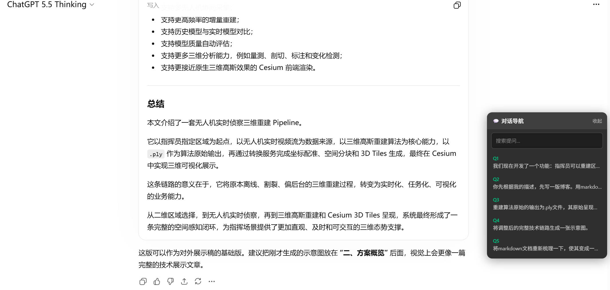

## Aizex Panel

Aizex是一个基于GPT原生UI的“GPT X 聚合多系列模型”使用方案。

提供GPT、Claude、Gemini、Grok等一系列LLM。

https://aizex.net/

---

## 痛点

在对话时，一个对话往往会积累几十轮问答。想回头看某个问题，只能靠鼠标滚轮一路翻，或者拖动右侧滚动条盲猜位置。内容一多，这个过程非常低效。

理想的状态是：有一个侧边目录，把我所有的提问列出来，点一下就跳过去。

---

## 思路

Aizex Panel-ChatGPT 是 React 单页应用，每一轮对话都有稳定的 DOM 标记：

```
data-testid="conversation-turn-1"
data-testid="conversation-turn-2"
...
```

用户消息和 AI 回复通过 `data-message-author-role` 区分：

```
data-message-author-role="user"
data-message-author-role="assistant"
```

有了这两个锚点，就可以在不修改网站源码的情况下，用油猴脚本向页面注入一个浮动导航面板。

---

## 实现

### 安装方式

1. 浏览器安装 [Tampermonkey](https://www.tampermonkey.net/) 扩展（Chrome / Edge 均可）
2. 新建脚本，把 `chatgpt-nav.user.js` 的内容粘贴进去，保存
3. 访问 `https://mana-x.aizex.net/` 或 `https://chatgpt.com/` 任意对话页面，面板自动出现

### 脚本结构

```
chatgpt-nav.user.js
├── 样式注入        — 暗色主题浮动面板，与 ChatGPT 界面协调
├── getUserTurns()  — 扫描 DOM，提取所有用户提问
├── renderList()    — 渲染列表，支持关键词过滤
├── createPanel()   — 创建面板，绑定交互事件
├── init()          — 初始化，启动 MutationObserver 监听新消息
└── waitAndInit()   — 等待对话内容加载完成后再初始化
```

### 核心功能

**提问列表**

扫描页面所有 `conversation-turn-*` 节点，过滤出 `role="user"` 的轮次，提取前 80 字作预览，去掉 "你说：" 等界面前缀后显示为 `Q1`、`Q2`... 的编号列表。点击任意条目，页面平滑滚动到对应位置。

**实时搜索**

面板顶部有搜索框，输入关键词后列表实时过滤，大小写不敏感。

**收起 / 展开**

点击标题栏可以将面板收起为一个 40px 的圆形气泡（只显示 💬 图标），不遮挡阅读区域。状态存入 `localStorage`，刷新页面后保持。

**收起状态可拖拽**

收起后的气泡支持拖动到屏幕任意位置。松手后位置自动保存，下次收起时恢复到上次拖放的位置。展开状态始终回到右侧居中的默认位置。

用 4px 的移动阈值区分"点击展开"和"拖动移位"，两个操作不会互相干扰。

**自动刷新**

用 `MutationObserver` 监听对话区域的 DOM 变化，新消息出现后 500ms 内自动刷新导航列表。

**SPA 路由感知**

ChatGPT 切换对话不会刷新页面，脚本通过对比 `location.href` 检测路由变化，打开新对话时自动重新初始化面板。

**Markdown 导出（v1.4 新增）**

面板工具栏增加了复选框和导出按钮。勾选若干提问后点击「📥 导出 Markdown」，自动下载一个 `.md` 文件，包含所选问题的完整 Q&A 内容。

导出时脚本会扫描对话 DOM 提取完整的 Q&A 配对（问题 + 回答），然后将回答的 HTML 转回标准 Markdown：

- **LaTeX 公式**：从 KaTeX 的 `<annotation encoding="application/x-tex">` 或 MathJax 的 `<script type="math/tex">` 中提取原始 LaTeX 源码，行内公式用 `$...$`，块级公式用 `$$...$$`
- **表格**：`<table>` 转为管道风格的 Markdown 表格，自动检测表头并插入分隔行，单元格内的 `|` 自动转义
- **代码块**：`<pre><code class="language-python">` 转为带语言标签的 fenced code block
- **行内格式**：粗体、斜体、链接、图片、删除线等一一对应转换
- **列表**：有序/无序列表正确转为 Markdown 列表格式

转换管道仅在用户点击导出时运行，不影响导航面板的响应速度。

工具栏提供全选复选框（支持 indeterminate 半选状态），选中计数实时显示。搜索过滤时不可见的项保留其选中状态，不会被意外清空。

**收起气泡防丢失（v1.4 修复）**

收起后的气泡支持拖拽，但之前保存的位置坐标没有做边界检查——如果将气泡拖到外接显示器边缘，回到笔记本屏幕后气泡坐标可能完全超出视口，导致"消失"。

v1.4 新增 `clampPosition()` 函数，在保存和恢复位置时都将坐标限制在视口可见范围内（至少保留 8px 可被点击拖回）。同时在收起状态下用点击延迟（350ms）区分"单击展开"和"双击重置"——双击时跳过展开流程，直接重置位置并清除损坏的 localStorage 数据。


## 关键细节

**拖拽与点击的区分**

mousedown 时记录起始坐标，mousemove 时判断位移是否超过 4px，超过才标记为拖拽。mouseup 时如果是拖拽则保存位置、阻止 click 触发展开；如果没有移动则正常展开。

```js
panel.addEventListener('mousedown', (e) => {
  const startX = e.clientX, startY = e.clientY;
  panel._dragged = false;
  function onMove(e) {
    if (Math.abs(e.clientX - startX) > 4 || Math.abs(e.clientY - startY) > 4)
      panel._dragged = true;
    // ...移动面板
  }
  // ...
});

header.addEventListener('click', (e) => {
  if (panel._dragged) { panel._dragged = false; return; }
  // ...切换展开/收起
});
```

**收起气泡的尺寸问题**

最初把标题 "💬 对话导航" 也放在收起状态里，但 40px 的宽度装不下，文字会被 `overflow: hidden` 截断。解决方案是在 HTML 里维护两套内容：展开时显示标题和"收起"按钮，收起时只显示独立的 `.__nav-icon` 元素，通过 CSS 互相切换显隐。

**HTML → Markdown 转换的表驱动方式**

转换器用递归下降方式遍历 DOM 树，对块级元素和行内元素分别处理。块级元素（`<p>`、`<h1>~<h6>`、`<pre>`、`<table>`、`<ul>/<ol>` 等）前后加空行保证 Markdown 段落间距，行内元素（`<strong>`、`<em>`、`<code>`、`<a>` 等）直接拼接对应符号。最后用 `/\n{3,}/g → \n\n` 压缩多余空行。

```js
// HTML → Markdown 的核心分发逻辑（简化版）
function processElement(el) {
  // KaTeX 优先处理：提取原始 LaTeX，避免 textContent 损失公式语义
  if (el.classList.contains('katex')) {
    var latex = extractLatexSource(el);
    return isLatexDisplay(el) ? '\n\n$$\n' + latex + '\n$$\n\n' : '$' + latex + '$';
  }
  // 块级元素包裹空行
  switch (el.tagName.toLowerCase()) {
    case 'p':     return '\n\n' + processChildren(el) + '\n\n';
    case 'h2':    return '\n\n## ' + processChildren(el) + '\n\n';
    case 'pre':   return '\n\n```' + lang + '\n' + code + '\n```\n\n';
    case 'table': return '\n\n' + tableToMarkdown(el) + '\n\n';
    case 'ul':    return '\n\n' + processListItems(el) + '\n\n';
    // 行内元素直接拼接
    case 'strong': return '**' + processChildren(el) + '**';
    case 'a':      return '[' + processChildren(el) + '](' + href + ')';
    // 容器元素递归穿透
    case 'div': case 'span': return processChildren(el);
  }
}
```

**KaTeX 公式提取的多策略回退**

ChatGPT 使用 KaTeX 渲染数学公式，原始 LaTeX 保存在 `<annotation encoding="application/x-tex">` 中。但不同版本/镜像的 DOM 结构可能不同，脚本设计了 4 层回退：

1. KaTeX 标准：`.katex-mathml` → `<annotation encoding="application/x-tex">`
2. data 属性：KaTeX 包裹元素上的 `data-tex` 属性
3. MathJax 脚本：父元素中的 `<script type="math/tex">`
4. 降级：以上都找不到时，退回到 `el.textContent`（会丢失公式结构，但不丢文字）

判断块级/行内公式：检查元素是否有 `.katex-display` 类，或父元素中是否有 `mode=display` 的 MathJax 脚本。

**位置边界检查**

`clampPosition()` 在每次保存和恢复位置时介入。允许气泡最多 36px 在屏幕外（保证始终有 8px 可被手指点中拖回），NaN/null 等坏值回退到默认右下角。配合双击重置，彻底解决了气泡消失后用户手足无措的问题。


## 适配范围

脚本的 `@match` 规则覆盖两个域名：

```
https://mana-x.aizex.net/*   — Aizex 合租面板代理的 ChatGPT
https://chatgpt.com/*        — ChatGPT 官网
```

两者的 DOM 结构相同（均为 ChatGPT 前端），无需额外适配。

---

## 效果



---

## 文件

| 文件 | 说明 |
|------|------|
| `chatgpt-nav.user.js` | 油猴脚本本体，安装到 Tampermonkey 即可使用。 |

<a href="./chatgpt-nav.user.js" download="chatgpt-nav.user.js">下载代码</a>

---

*初版开发于 2026-06-22，使用 Kiro + playwright-cli 辅助调试页面结构。*
*2026-07-04 更新 v1.4：新增 Markdown 导出（支持 LaTeX 公式/表格/代码块正确转换），修复收起气泡位置丢失bug。*
